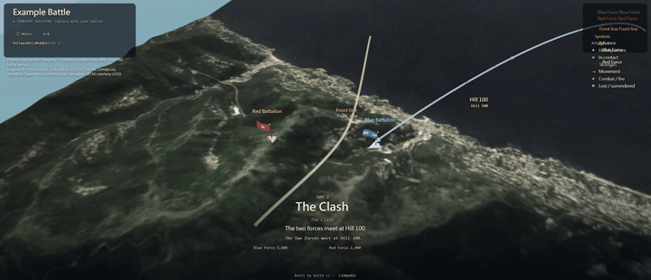

<div align="center">

# cinematic-3d-battle-engine

### Turn any battle, historical or fictional, into a self-playing 3D documentary on real-scale satellite and elevation terrain. No build, no backend, no API keys.

[](https://keithligh.github.io/cinematic-3d-battle-engine/)
&nbsp;
[](LICENSE)
&nbsp;
[](https://threejs.org/)
&nbsp;
[](#quick-start)
&nbsp;
[](https://claude.com/claude-code)
&nbsp;
[](https://github.com/keithligh/cinematic-3d-battle-engine)

</div>

---

This is the engine behind two finished documentaries:

- **[The Battle of Hong Kong, 1941](https://github.com/keithligh/battle-of-hong-kong-1941)**
- **[D-Day: The Normandy Landings, 1944](https://github.com/keithligh/d-day-normandy-1944)**

It renders a battle as a directed, self-playing film: a cinematic camera moves itself through the campaign over **real
elevation and satellite imagery** projected to scale, with troop movements, period flags, bilingual narration, weather,
and a day/night cycle. Everything is **data-driven**: a battle is described in one data file, the engine renders it, and
the engine modules themselves never change from one battle to the next.

The repo ships a small **fictional "Example Battle"** (Blue Force vs Red Force) so it runs the moment you clone it.

[](https://keithligh.github.io/cinematic-3d-battle-engine/)

<div align="center"><b>▶ <a href="https://keithligh.github.io/cinematic-3d-battle-engine/">Try the live demo</a></b></div>

## Build your own: just ask an AI

You do not need to write code, and you do not need to be a coder. Fork this repo, open it in an AI coding agent (Claude
Code, Codex, or similar), and ask it to build your battle. The agent does the work: it researches the history, writes
the data, draws the period flags, sets the map, and runs it. You direct and fact-check; the agent builds. That is the
whole idea, a finished 3D documentary of any battle without you ever touching the engine.

A ready starting prompt is in **[PROMPT.md](PROMPT.md)** (the
[Battle of Hong Kong](https://github.com/keithligh/battle-of-hong-kong-1941) began the same way, from its own
[PROMPT.md](https://github.com/keithligh/battle-of-hong-kong-1941/blob/main/PROMPT.md)). The agent's full runbook is
**[AGENTS.md](AGENTS.md)**, and the field reference it follows is **[PLAYBOOK.md](PLAYBOOK.md)**.

## Quick start

Map tiles load over HTTP, so serve the folder (opening `index.html` via `file://` will not work).

1. **Fetch the terrain and imagery tiles for the example** (first time only):
   ```
   node tools/fetch_tiles.mjs
   ```
2. **Serve and open:**
   ```
   node tools/serve.js
   ```
   then open <http://localhost:5050>. (Windows: double-click `start.bat`; macOS/Linux: `sh start.sh`.)

You should see the fictional Example Battle play itself. Now read PLAYBOOK.md and make it yours.

## Under the hood

You do not have to know any of this, but it is why an AI can build a whole documentary by editing data alone: a battle
is a **data** project, not an engine project. The battle layer is `data.js` (forces, dated movements, the storyboard,
narration), `flags.js` (each side's flag art), and the `index.html` title and social meta. The engine modules
(`config.js`, `app.js`, `core.js`, `terrain.js`, `director.js`, and the rest) read every value from the data and never
change from one battle to the next.

## Features

- **Battle-agnostic.** Any number of sides, any forces, any land or coastal geography on Earth (tiles come from global, key-less providers).
- **Any language.** Bilingual by design (a primary plus a secondary language), any script, including right-to-left (set `meta.fonts` and `meta.dir`).
- **Any look.** Restyle the sky, sea, sun, fog, and the film grade per battle via `meta.theme`.
- **Fails loud, not silent.** A boot validator names the exact missing or mistyped field, in the browser and from the command line (`node tools/validate.mjs`), so a broken `data.js` never half-renders.
- **Honest by design.** `notes.sources` is a required field: the engine will not start a battle that cites no sources.
- **Zero infrastructure.** Static files, Three.js r128, no build step, no backend, no API keys.

## How it works

- **Terrain:** AWS "Terrarium" elevation tiles (SRTM/USGS, public domain) decoded to a real height-mesh, Web-Mercator, to scale.
- **Surface:** EOX *Sentinel-2 cloudless 2016* satellite imagery draped over the terrain.
- **Direction:** a state-machine "Director" plays a fixed storyboard of shots; grab the camera to free-look and it resumes.
- **Data contract:** `validate.js` defines exactly what a renderable battle needs, and the same file runs at boot and from the CLI, so the two can never disagree.

## How it was built

This engine was built through agentic engineering: it started from an initial prompt and was engineered, pass by pass,
into a reusable, battle-agnostic system. The interesting part is not the AI, it is the architecture and the judgment
around it. To build a battle of your own on top of it, [just ask an AI](#build-your-own-just-ask-an-ai).

## Licensing

- **Code:** MIT, see [`LICENSE`](LICENSE).
- **Third-party software and data** (Three.js, the Sentinel-2 imagery, the SRTM elevation) keep their own licenses; see [`THIRD_PARTY_NOTICES.md`](THIRD_PARTY_NOTICES.md).
- Battles you build carry whatever license you choose for your own `data.js` content.

## Author

Built by **Keith Li**. Find me on [LinkedIn](https://www.linkedin.com/in/keithlihk/).
